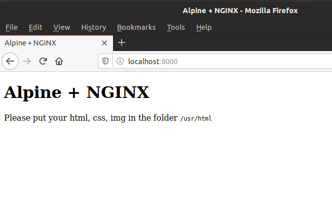

# Alpine NGINX
## Introduction
This is an Alpine Linux docker that is based on the Hacking-Lab CTF `alpine-base` image. 

## Specifications
* based on alpine latest
* with s6 startup handling
* with dynamic ctf flag handling in `environment variables`
* with dynamic ctf flag handling in `files`

## Purpose
This NGINX docker will work as webserver and dynamic flags derrived from ENV or FILE

## Template `docker-compose.yml`
```
version: '3.4'

services:
  alpine-nginx-hobo:
    image: REGISTRY_BASE_URL/alpine-nginx:latest
    hostname: 'hobo'
    environment:
      - "domainname=idocker.REALM_DOMAIN_SUFFIX"
    labels:
      - "traefik.port=80"
      - "traefik.frontend.rule=Host:hobo.REALM_DOMAIN_SUFFIX"
      - "traefik.protocol=http"
    env_file:
      - ./UUID.env
    volumes:
      - ./UUID.gn:/goldnugget/UUID.gn
      - ./flag-deploy-scripts:/flag-deploy-scripts
```


## TESTING `alpine-nginx-example`
* UUID = 63bee851-fa73-4177-badd-ee74761f283e
* example subfolder in ./alpine-base/alpine-nginx-example

```
root@demide:/home/ibuetler/Repository/alpine-nginx# cd alpine-nginx-example

root@demide:/home/ibuetler/Repository/alpine-nginx/alpine-nginx-example# ls -al 
total 40
drwxr-xr-x 5 ibuetler ibuetler 4096 Dez 10 17:34 .
drwxr-xr-x 7 root     root     4096 Dez 10 17:29 ..
-rw-r--r-- 1 ibuetler ibuetler   26 Dez 10 17:19 63bee851-fa73-4177-badd-ee74761f283e.env
-rw-r--r-- 1 ibuetler ibuetler   26 Dez 10 17:19 63bee851-fa73-4177-badd-ee74761f283e.gn
-rwxr-xr-x 1 ibuetler ibuetler   56 Dez 10 17:24 build.sh
-rw-r--r-- 1 ibuetler ibuetler  399 Dez 10 17:27 docker-compose.yml
-rw-r--r-- 1 ibuetler ibuetler  375 Dez 10 17:26 Dockerfile
drwx------ 2 ibuetler ibuetler 4096 Dez 10 17:19 flag-deploy-scripts
drwxr-xr-x 2 ibuetler ibuetler 4096 Dez 10 17:24 htdocs
drwxr-xr-x 4 ibuetler ibuetler 4096 Dez 10 17:19 root
```

Content of `docker-compose.yml` with a real UUID
```
root@demide:/home/ibuetler/Repository/alpine-nginx/alpine-nginx-example# cat docker-compose.yml 
version: '3.4'

services:
  alpine-nginx:
    image: hackinglab/alpine-nginx:latest
    hostname: 'alpine-nginx'
    env_file:
      - ./63bee851-fa73-4177-badd-ee74761f283e.env
    volumes:
      - ./63bee851-fa73-4177-badd-ee74761f283e.gn:/goldnugget/63bee851-fa73-4177-badd-ee74761f283e.gn
      - ./flag-deploy-scripts:/flag-deploy-scripts
      - ./htdocs:/usr/html
    ports:
      - 8000:80
```

Content of UUID.env (do not change this!!!)
```
root@demide:/home/ibuetler/Repository/alpine-nginx/alpine-nginx-example# cat 63bee851-fa73-4177-badd-ee74761f283e.env 
GOLDNUGGET=SED_GOLDNUGGET
```

Content of UUID.gn (do not change this!!!)
```
root@demide:/home/ibuetler/Repository/alpine-nginx/alpine-nginx-example# cat 63bee851-fa73-4177-badd-ee74761f283e.gn 
GOLDNUGGET=SED_GOLDNUGGET
```

Content of `flag-deploy-scripts` folder
* deploy-env-flag.sh = your code how you want to deploy the flag in the CTF docker
* deploy-file-flag.sh = your code how you want to deploy the flag in the CTF docker

```
ibuetler@demide:~/Repository/alpine-base-example$ ls -al flag-deploy-scripts/
total 16
drwx------ 2 ibuetler ibuetler 4096 Dez 10 09:58 .
drwxr-xr-x 4 ibuetler ibuetler 4096 Dez 10 09:59 ..
-rwx------ 1 ibuetler ibuetler   89 Dez 10 09:58 deploy-env-flag.sh
-rwx------ 1 ibuetler ibuetler   90 Dez 10 09:58 deploy-file-flag.sh
```


## BUILDING with `docker build`
```
root@demide:/home/ibuetler/Repository/alpine-nginx/alpine-nginx-example# docker build -t hackinglab/alpine-nginx -f Dockerfile .
Sending build context to Docker daemon  22.02kB
Step 1/5 : FROM hackinglab/alpine-base:latest
 ---> 7553de783868
Step 2/5 : MAINTAINER Ivan Buetler <ivan.buetler@compass-security.com>
 ---> Using cache
 ---> b777c5f7b771
Step 3/5 : RUN apk add --update nginx &&     rm -rf /var/cache/apk/* &&     chown -R nginx:www-data /var/lib/nginx
 ---> Using cache
 ---> 4c4056f8397d
Step 4/5 : ADD root /
 ---> Using cache
 ---> 8652ced416e4
Step 5/5 : EXPOSE 80
 ---> Using cache
 ---> 056b84ce647f
Successfully built 056b84ce647f
Successfully tagged hackinglab/alpine-nginx:latest
``` 

## TESTING docker-compose.yml using `docker-compose config`
```
root@demide:/home/ibuetler/Repository/alpine-nginx/alpine-nginx-example# docker-compose config
services:
  alpine-nginx:
    environment:
      GOLDNUGGET: SED_GOLDNUGGET
    hostname: alpine-nginx
    image: hackinglab/alpine-nginx:latest
    ports:
    - published: 8000
      target: 80
    volumes:
    - /home/ibuetler/Repository/alpine-nginx/alpine-nginx-example/63bee851-fa73-4177-badd-ee74761f283e.gn:/goldnugget/63bee851-fa73-4177-badd-ee74761f283e.gn:rw
    - /home/ibuetler/Repository/alpine-nginx/alpine-nginx-example/flag-deploy-scripts:/flag-deploy-scripts:rw
    - /home/ibuetler/Repository/alpine-nginx/alpine-nginx-example/htdocs:/usr/html:rw
version: '3.4'
```

## RUNNING container using `docker-compose up`
```
root@demide:/home/ibuetler/Repository/alpine-nginx/alpine-nginx-example# docker-compose up
Creating network "alpine-nginx-example_default" with the default driver
Creating alpine-nginx-example_alpine-nginx_1 ... done
Attaching to alpine-nginx-example_alpine-nginx_1
alpine-nginx_1  | [s6-init] making user provided files available at /var/run/s6/etc...exited 0.
alpine-nginx_1  | [s6-init] ensuring user provided files have correct perms...exited 0.
alpine-nginx_1  | [fix-attrs.d] applying ownership & permissions fixes...
alpine-nginx_1  | [fix-attrs.d] 01-resolver-resolv: applying... 
alpine-nginx_1  | [fix-attrs.d] 01-resolver-resolv: exited 0.
alpine-nginx_1  | [fix-attrs.d] done.
alpine-nginx_1  | [cont-init.d] executing container initialization scripts...
alpine-nginx_1  | [cont-init.d] 10-adduser: executing... 
alpine-nginx_1  | =================================
alpine-nginx_1  | 
alpine-nginx_1  | =================================
alpine-nginx_1  | USERNAME not defined - will use default username hacker
alpine-nginx_1  | chpasswd: password for 'root' changed
alpine-nginx_1  | chpasswd: password for 'hacker' changed
alpine-nginx_1  | 
alpine-nginx_1  | -------------------------------------
alpine-nginx_1  | GID/UID
alpine-nginx_1  | -------------------------------------
alpine-nginx_1  | User uid:    2000
alpine-nginx_1  | User gid:    2000
alpine-nginx_1  | -------------------------------------
alpine-nginx_1  | 
alpine-nginx_1  | [cont-init.d] 10-adduser: exited 0.
alpine-nginx_1  | [cont-init.d] 30-resolver: executing... 
alpine-nginx_1  | [cont-init.d] 30-resolver: exited 0.
alpine-nginx_1  | [cont-init.d] 40-resolver: executing... 
alpine-nginx_1  | [cont-init.d] 40-resolver: exited 0.
alpine-nginx_1  | [cont-init.d] 99-add-flag: executing... 
alpine-nginx_1  | 
alpine-nginx_1  | ====== testing for flag in environment variable =======
alpine-nginx_1  | flag found in environment variable GOLDNUGGET=SED_GOLDNUGGET
alpine-nginx_1  | what do you want to do with the flag in the environment variable?
alpine-nginx_1  | please define what you want to do with the flag in /flag-deploy-scripts/deploy-env-flag.sh
alpine-nginx_1  | executing /flag-deploy-scripts/deploy-env-flag.sh
alpine-nginx_1  | put your commands to deploy the env based flag here
alpine-nginx_1  | 
alpine-nginx_1  | ====== testing for flag in /goldnugget folder ======
alpine-nginx_1  | flag file found in /goldnugget
alpine-nginx_1  | total 4
alpine-nginx_1  | -rw-r--r--    1 go-dnsma go-dnsma        26 Dec 10 16:19 63bee851-fa73-4177-badd-ee74761f283e.gn
alpine-nginx_1  | what do you want to do with the flag file?
alpine-nginx_1  | please define what you want to do with the flag in /flag-deploy-scripts/deploy-file-flag.sh
alpine-nginx_1  | executing /flag-deploy-scripts/deploy-file-flag.sh
alpine-nginx_1  | put your commands to deploy the file based flag here
alpine-nginx_1  | 
alpine-nginx_1  | =============================================
alpine-nginx_1  | [cont-init.d] 99-add-flag: exited 0.
alpine-nginx_1  | [cont-init.d] done.
alpine-nginx_1  | [services.d] starting services
alpine-nginx_1  | [services.d] done.
```

## Screenshot Running Container
* Content of /usr/html in container




## Conclusion
The alpine-nginx docker can take flags via ENV or via FILE

## Who takes care of the flag? 
Hacking-Lab CTF docker containers are spinned up by a component called `docker manager`. Based on the per-docker configuration (not explained above and here), the docker manager will create random values and sets the flags throughout the ENV or FILE attribute.
